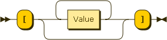
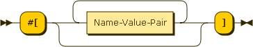
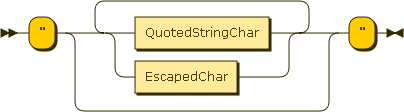
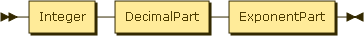
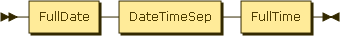

Mirror of page [https://pointillistic.com/ren/](https://pointillistic.com/ren/) for use as memo purpouse.

# Ren - The Human Notation

This is what Ren looks like.

```
   []			; empty list
   #()			; empty map
   [a 1 true #three]	; non-empty list
   #(a: 1 b: "two")	; non-empty map
   "Ren Example 1"	; string
   -42			; number
   98.6			; another number
   true			; literal true
   false		; literal false
   none			; literal nil/null/nada
   #(			; a bigger map
       quote:	 "禅 saying: ^"仁 rocks!^""
       utf-8:    "^(CE91) to ^(cf89)"
       sci-phi:  0.1618e1
       tax-rate: 3.9%
       price:    $79.99
       url:      http://www.ren-data.org/
       email:    info@ren-data.org
       hashtag:  #ren
       date:     2013-04-17/18:37:39-06:00
       warning:  00:02     ; = 00:00:120.0
       ip-addr:  127.0.0.1
       geo-pos:  43.6x116.7x817
       hex:      16#{DECAFBAD CAFE 00FF}
       base-64:  64#{UmVuIGlzIGRhdGE=} 
   )
```

Goals:
* Improve the data signal-to-noise ratio
* Be easy for humans to read and write
* Keep it simple, but not too simple
* Define common, useful datatypes
* Be easy to parse and generate

Uses:
* Communication between people and machines
* Document-oriented databases
* Embedded data storage
* Configuration files
* Messaging

**Ren** is a lightweight data-exchange text format. It is programming language independent with familiar conventions. Whitespace separates values, but is not significant beyond that.

Ren has two main data structures:
* An ordered group of values, called a _list_ (array, block or collection)
* A collection of name/value pairs, called a _map_ (e.g., a map, object, dictionary, hash(table), or associative array)

These data structures are almost universally supported in modern programming languages. A data format that is meant to be exchanged between different programming languages needs to consider their lowest common denominator. But it should also be nice for the people who use those languages.

These data structures are the lowest common denominator in modern programming languages. It could be argued—and we did—that only _list_ is needed, but _map_ is used so widely that it  was deemed an important element. You can, of course, use only lists in Ren and interpret them as maps as you see fit.

In Ren, the data structures take these forms:

A _list_ is an ordered group of values. A list begins with [ left square bracket) and ends with ] (right square bracket) or begins with ( (left paren) and ends with ) (right paren). Values are separated by
whitespace.




A map is an unordered set of name/value pairs. A map begins with **#[** (hash) (left bracket) and ends with **]** (right bracket). The first element in a map must be a name. Names end with **:** (colon)(whitespace) and the name/value pairs are separated by whitespace. A map is just a list, identified by the fact that the first element is a name, and it must always contain an even number of values. That is, each name must have an associated value.



A string is a series of zero or more UTF-8 code points, enclosed in double quotes, using caret escapes where necessary. A character (char) is represented as a string containing a single code point. There is no separate notation for individual characters. Mutliline strings are also allowed, enclosed in matching curly or angle brackets
(**{ }** or **< >**).



A number is just how a base-10 human would write it.



Logic values are any of the literal words in the list  [true false on off yes no]. Why not just true and false? Because the other words add meaning but very little complexity.

The word none means nothing. Rather, it means something could be there, but nothing is. It isn't zero, that would be null, but Ren doesn't use null; it uses the number zero to mean zero. None is like nil or nothing. When the choice was made, _nil_ _nothing_ none of the other options sounded as good.

What happens when we want to venture beyond these basic value types?
How do we decide what Ren can and should support? 

First, look at the things people talk about, and that need to be represented when communicating between people (especially technical people like programmers), or between programs and systems. A few obvious examples are dates and times, email and IP addresses, UI positions and sizes, and URLs.

Next, consider what can be represented as a literal value, in plain text. By limiting ourselves to a text format, we make it possible, even easy, for people to write data directly (e.g., config files), and to read the data that came from somewhere else. One problem is that human readable text has to use a limited set of characters and conventions, or it will be too complex to deal with. That imposes a constraint in terms of the lexical space we can use. That is, once we use a character, or sequence of characters, and ascribe meaning to that, we can't use it for something else. That means we can't represent an unlimited set of value types without sacrificing simplicity.

Finally, look for generalities, weigh the options, determine priorities, and compromise.
 
Remember, whitespace separates values.

Comments may be included. They start with a semicolon (**;**) and continue through the end of a line, which is denoted by the new-line character (ASCII character code 10).

Ren has a large number of Value types, which distinguishes it from other data exchange languages that support only a few native data types, common in most programming languages, where everything else becomes 
a string. The problem is that you then have to look at every string value and decide what it might mean, based on its contents. This is work that shouldn't have to be redone in every application. And while it isn't possible to include every possible datatype used in every language and system, there are some common values that can provide a big return on investment for a small amount of additional complexity in the Ren grammar. Leveraging commonalities and grouping values into a shallow type 
hierarchy also helps manage complexity.

A date-time value conforms to the [rfc3339.txt](http://www.ietf.org/rfc/rfc3339.txt) standard, with the addition of allowing a **/** (slash) to be used in place of T as the separator between the date and time. 
It is one of the more complex types in Ren, but adds so much value that it's worth supporting. In addition to absolute date-time values, Ren supports relative dates and times (rel-date-time) used for durations, offsets, or spans of time. Their format is consistent with date-time values, and very close to the alternate format for durations in [ISO 8601](https://en.wikipedia.org/wiki/ISO_8601#Durations).




Word and Name values are like symbols or identifiers in languages that support them. They can't start with a digit or one of a small set of special reserved characters, but they can contain digits after the first character. They can't contain spaces. That would make them more than one word. A Name is just a word with a colon at the end. Names are most often used as keys in maps, but are valid values anywhere. While other notations use strings as keys, which means you can use almost character in a key, you have to use quotes around every name, whether they contain spaces or not. Statistics show that 99.987% of names do not contain spaces. If one of your names is in the 0.013%, replace the spaces with something else and move on, or use a list.

The hashtag is a popular trend at the time of this writing, but it's really nothing special. It's a word that starts with **#** and can use digits as the first character. Beyond current popularity, it is a convenient type to use for serial numbers, phone numbers, or other values that aren't strictly numeric, but are based in numbers.
That is, strings of digits.

An implied-string is somewhere between a word and a string. You don't have to put them in quotes, but they also can't contain whitespace. They are like multi-part words that may contain certain special characters words can't, like colons and slashes. They are used for URLs, email addresses, filenames and more. For implied strings that contain spaces, they must be escaped somehow. e.g., for URLs, you can use percent encoding as a normal form.

Tuples are lists of numbers that can be used for IP addresses and color values. They use a dot as their part separator, can't contain decimal values, and must contain at least three parts (to differentiate them from decimal values).

Point values are used to denote coordinates. They are like tuples, except that they use **x** as the part separator and they may contain decimal values, because there is no ambiguity.

Binary values come in two flavors, base-16-binary and base-64-binary.
They begin with **#{** (hash left-brace) and end with **}** (right brace). Between the braces, the allowed characters depend on the base, and the number of characters must match a well-formed value for that type. For example, base-16 values must come in pairs of two hex digits. You cannot specify a nibble with one hex digit. Binary values may contain spaces and line breaks, which are ignored.
